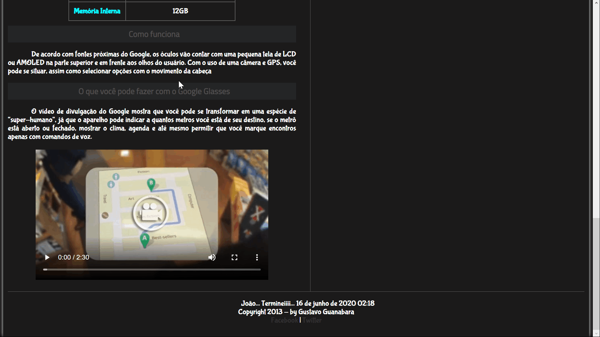
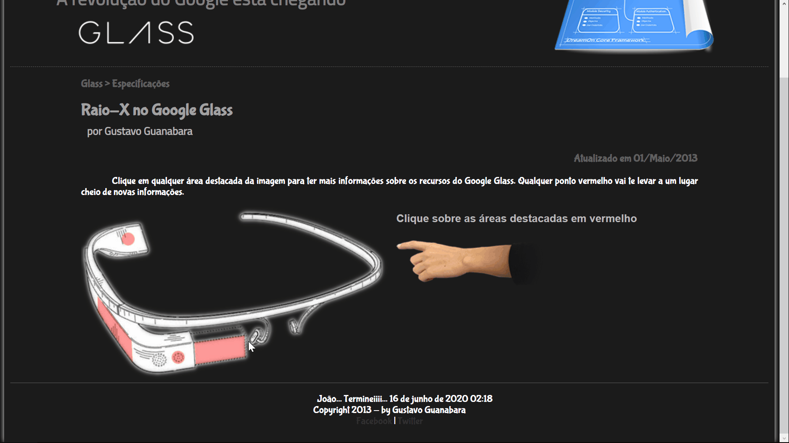
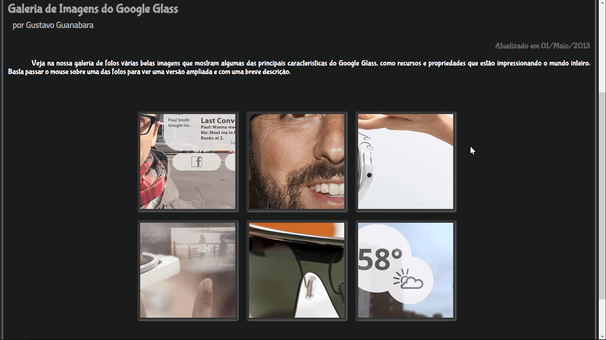
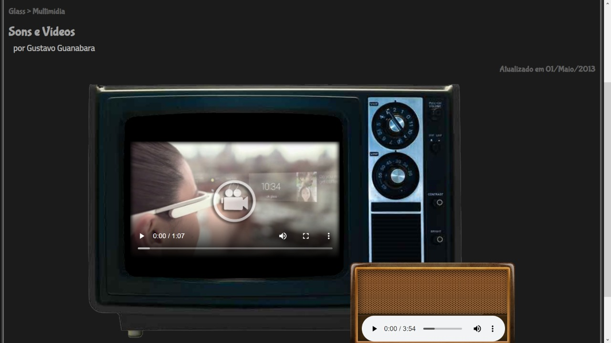
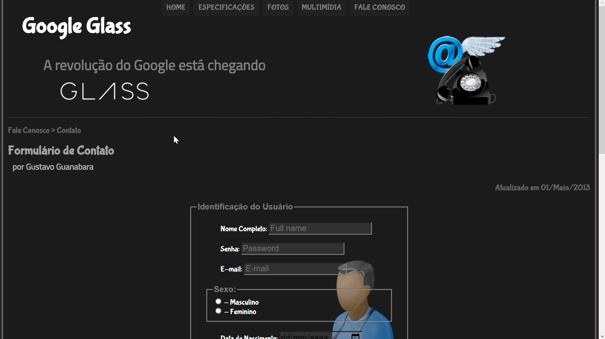

# HTML5-CSS3

My first learnings with HTML5 and CSS3, Based on the "Curso em vídeo" course.

    

## This project was developed with:

- [x] HTML 5

- [x] CSS 3

- [x] JavaScript

## Pages

### Index page

    

### Specs

    

### Pictures

    

### Multimedia

    

### Forms

    

